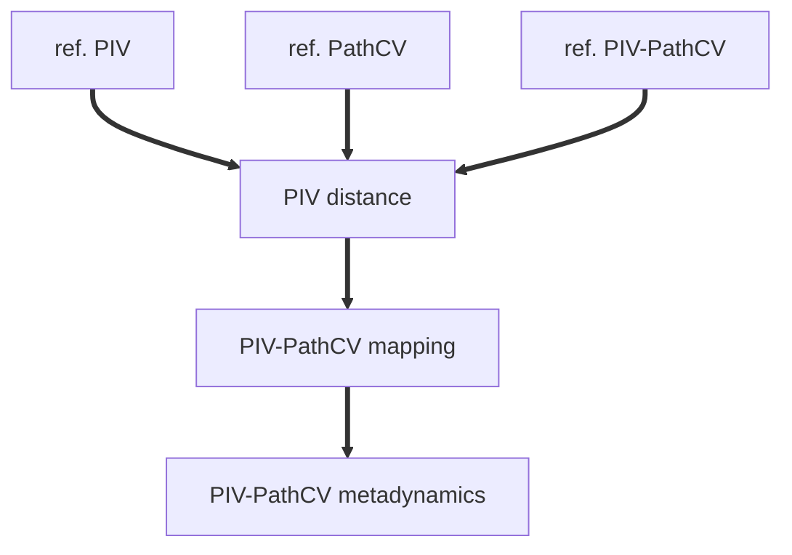

```mermaid
flowchart TB
A[ref. PIV] ==> D[PIV distance]
B[ref. PathCV] ==> D
C[ref. PIV-PathCV] ==> D
D ==> E[PIV-PathCV mapping]
E ==> F[PIV-PathCV metadynamics]
click A "paper1" "reference for PIV"
click B "paper2" "reference for PathCV"
click C "paper3" "reference for PIV-PathCV"
click D "PIV_distance.md" "Associating PIVs to system configurations PIVs and cmputing distances"
click E "PIV-PathCV_driver.md" "Mapping a trajectory into PIV-PathCV space"
click F "PIV-PathCV_meta.md" "Biasing a simulation in the PIV-PathCV space"
```
